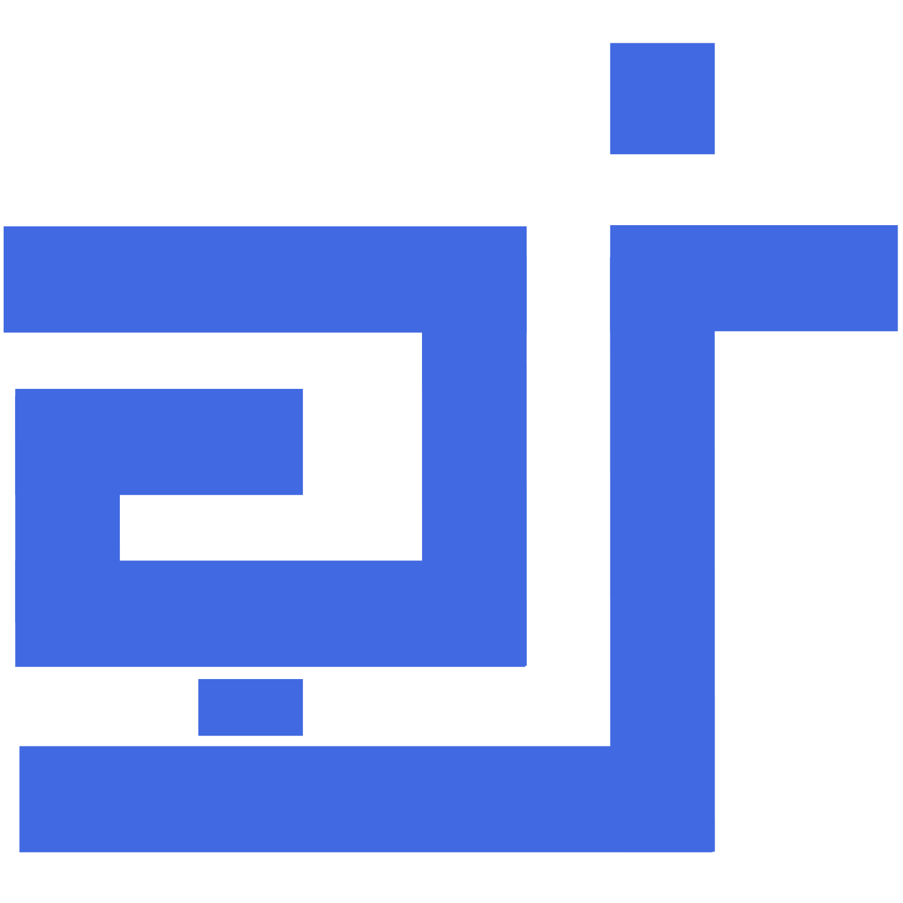

# FundusGuard AI 
### A Project by kidKrishkode

## Introduction
FundusGuard AI is an autonomous, next-generation medical advisory platform designed to revolutionize early Glaucoma screening and diagnosis. Powered by Deep Learning and Explainable Artificial Intelligence (XAI), the system acts as a trusted clinical assistant—not only predicting whether eye glaucoma is present from retinal fundus images, but explicitly defining *why* the diagnosis was made.

Whether you are an ophthalmologist seeking an interpretable second opinion, a clinical researcher reviewing diagnostic heatmaps, or a healthcare institution conducting large-scale community eye screenings, FundusGuard AI bridges the gap between complex black-box neural networks and transparent, human-verifiable medical decisions.

## Aim 🎯  
Our aim is to create an intelligent healthcare platform that:  
1. **Detects** early-stage glaucomatous structural changes using state-of-the-art Deep Learning models.  
2. **Explains** diagnostic results using Explainable AI (XAI) to highlight critical regions like the optic disc and optic cup.  
3. **Empowers** ophthalmologists and clinicians with transparent, data-backed diagnostic reasoning.  
4. **Supports** healthcare accessibility through fast, reliable, and scalable automated eye screening workflows.  

## How It Works 🛠️  
1. **User Onboarding**: Clinicians and diagnostic labs securely log into their tailored dashboard role.  
2. **Fundus Image Upload**: Users upload high-resolution color retinal fundus scan images.  
3. **Deep Learning Prediction**: Autonomous neural models process structural eye patterns to evaluate glaucoma risk.  
4. **XAI Interpretability**: The system generates visual heatmaps (e.g., Grad-CAM / feature saliency) pointing out specific optic cup-to-disc ratios and nerve layer thinning.  
5. **Doctor Advisor Report**: The platform compiles a comprehensive clinical summary detailing both the risk probability and visual proof.  
6. **Patient Data Tracking**: Longitudinal tracking allows medical professionals to monitor disease progression over time.  
7. **Export & Share**: Diagnostic reports with integrated visual explanations can be generated and exported for patient records.  

## 🚀 Features
- **Autonomous Glaucoma Detection** – Fast and accurate binary and multi-class classification from retinal fundus images.
- **Explainable AI (XAI) Visualizer** – Generates interpretable heatmaps showing exactly which pixel regions influenced the prediction.
- **Optic Disc & Cup Analysis** – Inspects structural indicators like cup-to-disc ratio (CDR) and nerve fiber layer irregularities.
- **Doctor Advisor Dashboard** – Interactive interface providing diagnostic suggestions alongside raw and highlighted scans.
- **Patient History & Progression Tracking** – Secure storage for past patient fundus scans to observe long-term structural changes.
- **Batch Fundus Processing** – Capability to upload and analyze multiple retinal scans for community-wide screening drives.
- **Instant Medical Report Export** – Generate downloadable PDF summaries complete with XAI visual evidence for clinical review.

## 🧠 Technology Stack
- **Frontend:** Embedded JS (EJS) as HTML/CSS, Vanilla JavaScript
- **Backend:** Node.js, JSON, TypeScript
- **API / Machine Learning:** Python (Deep Learning Engine & XAI Models), JSON
- **Architecture:** JPEN (JSON-Python-Embedded-Node)
- **Software Model:** Recursive Agile
- **Framework:** HEX framework

## 👨‍💻 Developer

This project was developed by **kidKrishkode** as a full-stack & AI engineer, with a strong focus on interpretable AI, healthcare technology, and scalable web architectures.

## 🏢 Ownership

FundusGuard AI is proudly created and maintained by **kidKrishkode**, an initiative dedicated to delivering transparent, medical-grade artificial intelligence solutions.

## 📚 Use Cases
- **Ophthalmology Clinics & Hospitals** – Assisting eye specialists with automated, visual second opinions during routine checkups.
- **Telemedicine & Remote Health** – Enabling rural health workers to conduct automated glaucoma screening without requiring on-site specialists.
- **Diagnostic & Imaging Centers** – Speeding up report generation for high-volume fundus imaging centers.
- **Medical Research & Education** – Serving as an educational tool to help medical students understand structural features of glaucoma.

## 📌 License

This project is proprietary and maintained by kidKrishkode. For clinical trial collaborations, API integration, or licensing inquiries, please contact the developer.